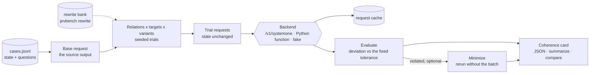

> **Archived.** The detailed README of JevBench 0.1.0, kept for reference: concepts, the case format, how a run works, how scores are computed, templates and rewrites, scope and limits. The current, shorter README is [here](../README.md); the method and results are in the [technical report](https://jevbench.github.io/report/JevBench-technical-report.pdf).

# JevBench

**Coherence tests for Jev-compatible typed decision models.**

[Website and leaderboard](https://jevbench.github.io) · [PyPI](https://pypi.org/project/jevbench/) · [Reproducing the results](https://github.com/JevBench/jevbench/blob/main/docs/reproducing.md) · [How the data were made](https://github.com/JevBench/jevbench/blob/main/docs/datagen.md)

JevBench measures whether a model's answers are consistent with one another, not
whether they are right and not how fast they come: it is a test of stability and
coherence under meaning-preserving and logically related edits, with no gold labels.

Typed decision models ("System One" models) answer questions about a fixed
`state` with probabilities over declared answers: a Noul (yes/no), a Choice
over named options, or a Score over ordered levels. Many such models now
exist, trained in very different ways. What they share is the interface:

```
f(state, question key, instructions, criteria) -> probability distribution over criteria
```

JevBench tests that interface. It never needs gold labels. It never edits the
state. It transforms only the question key, the instructions and the criteria,
and checks whether the answers keep the relations that probability and choice
theory say they must keep: the same answer after a meaning-preserving edit,
complementary probabilities for a question and its negation, Frechet bounds
for conjunctions, additivity when options are merged or cloned, independence
of irrelevant alternatives, isolation between questions in one batch.

JevBench is not affiliated with or endorsed by TypeSafe AI. "Jev" names the
wire interface (`POST /v1/systemone`) that JevBench speaks.

## Quick start

```bash
pip install jevbench                 # Python 3.10+, depends only on httpx
jevbench suites                      # the bundled suites: jevbench-mini (default), jevbench-240, examples
jevbench eval --backend fake:coherent --suite examples     # seconds: check that everything works
```

Against any server that speaks the System One wire format:

```python
import jevbench as jb

model = jb.systemone("http://127.0.0.1:8000/v1/systemone", model="open-jev")
jb.evaluate(model, suite="examples")                     # seconds: check that your model works with JevBench
report = jb.evaluate(model)                              # jevbench-mini, the suite results are reported on
full = jb.evaluate(model, suite="jevbench-240")          # optional: every test, narrower intervals
print(report.table("dimension"))                         # also "group", "relation", "domain"
report.save("runs/open-jev.json")

jb.evaluate(model, "jevbench-240", domains=["finance_ops", "logistics"]) # some domains (cases)
jb.evaluate(model, dimensions=["MEA"], groups=["CHO.conditioning"])      # some dimensions and groups
jb.evaluate(model, relations=["option_clone", "de_morgan"])              # some relations
jb.estimate("jevbench-240", domains=["finance_ops"])     # requests a run would send
print(jb.compare([report, other_report]))
```

The same from the shell:

```bash
export JEVBENCH_API_KEY=...          # if the server needs a bearer token
jevbench eval --url http://127.0.0.1:8000/v1/systemone --model open-jev \
  --dimensions MEA --concurrency 16 --out runs/open-jev.json
jevbench report runs/open-jev.json runs/other.json      # compare saved reports
```

- **Models.** `jb.systemone(url, model)` covers every Jev-compatible server;
  pass several comma-separated URLs to use replicas of one model in turn.
  A model in your Python process is tested with `jb.from_callable(fn,
  name="my-model-v1")`, where `fn(state, questions) -> answers`; pass a list
  of functions, one per GPU, to use them as replicas. The name keys the
  request cache, so give each model and version its own (without one,
  answers are cached for the run only). See `examples/in_process_model.py`.
- **Selection.** `domains` selects cases; `dimensions`, `groups` and
  `relations` select relations (their union). The overall score is reported
  only when all five dimensions were tested. Select domains on jevbench-240:
  jevbench-mini tests each relation on 2 cases per domain, fewer than the 5
  tests a relation needs to be scored (`min_n`).
- **Your own data.** `jb.evaluate(model, cases="my-cases.jsonl")`; generate
  cases for a new domain with `pip install jevbench[datagen]` and
  `jevbench datagen` (see below).
- **Speed.** Requests are cached (`.jevbench-cache/`). Most Jev servers
  answer one request at a time, so a run is sped up by replicas: start the
  model several times (one per GPU) and pass every URL; JevBench keeps one
  request in flight per replica, which gives exactly the sequential answers.

- **One fixed test set.** A bundled suite ships one frozen test plan, generated
  once without any model, with every trial's exact requests. It tests each
  relation exactly once per case: every relation of jevbench-240 has 240 tests,
  spread over all cases and, within a domain, as evenly as possible over its
  questions, with all of each test's variants. A run sends these requests and
  judges the answers; it draws no random numbers, and settings that would run
  other tests (another seed, rewrite bank or number of trials) are refused, so
  everyone runs the same tests. The plan is built against a sealed context: a
  relation that read model outputs while building a trial could not be
  frozen. Your own `cases=` are built from the seed, which is deterministic
  too, and `jevbench plan <suite dir>` freezes a suite of your own.
- **Which suite to report.** Results are reported on `jevbench-mini`, the
  default: the 240 cases of jevbench-240, each relation tested on 2 cases
  per domain (24 tests per relation), a ninth of the requests. Every one of
  its tests is a jevbench-240 test. On the 17 models we ran on both, the
  overall scores agree (Pearson 0.993, Spearman 0.978, mini minus 240 at most
  2.2 points, ranks moved by at most 2), and every pair of models that
  jevbench-240 separates (95% intervals apart) is ordered the same way by
  jevbench-mini. Its intervals are about 2.5 times as wide (4.4 against 1.7
  points), so read differences of a few points between models as ties, or
  run `suite="jevbench-240"` (optional) to separate them. Even on
  jevbench-240 a model's domain scores differ from its overall score by about
  as much as sampling noise, so we do not compare models by domain.
- **The demo suite.** `examples` is one hand-written customer-support case: a
  run takes seconds and shows that the tool works with your model. It scores
  each relation from its one test (`min_n` 1), so its numbers are a
  demonstration, never a result.

`jevbench run` is the low-level engine run over a JSONL of cases, kept for
scripts: `jevbench run --cases my-cases.jsonl --backend systemone:<model> --url ... --out x.json`.

## Results

The leaderboard of 21 openly released models, with every score, interval and accuracy, and the full
reports behind them, is on the [JevBench website](https://jevbench.github.io).
[docs/reproducing.md](https://github.com/JevBench/jevbench/blob/main/docs/reproducing.md) explains how to recompute it from the published reports or
run any of the models again.

## Connecting your model

JevBench reads the standard Jev format and nothing else: a model that
returns another format is asked to adapt, with a message that says how.
Check a model before a full run:

```bash
jevbench check --url http://127.0.0.1:8000/v1/systemone --model my-model
```

```python
jb.check(model)        # one request; returns a summary, or raises with what to fix
```

**What the model receives.** A `state` (the input to decide about: text or
JSON, never changed by JevBench) and a batch of typed `questions`, keyed by
question id:

```json
{
  "model": "my-model",
  "state": "Customer writes: Our nightly export has failed three nights in a row...",
  "questions": {
    "export_failing": {"type": "noul", "instructions": "Is a scheduled data export currently failing?"},
    "primary_team":   {"type": "choice", "instructions": "Which team should own the primary issue?",
                       "criteria": {"engineering": "Fixes broken product functionality",
                                    "billing": "Handles invoices, charges and refunds"}},
    "frustration":    {"type": "score", "instructions": "How frustrated does the customer sound?",
                       "criteria": ["Calm", "Mildly annoyed", "Clearly frustrated", "Angry"]}
  }
}
```

A Noul is a yes/no question and has no criteria. A Choice names its
options, each with a description. A Score lists ordered levels, lowest
first. Question ids, option ids and the number of questions per request
vary from test to test: a model must answer whatever it is asked.

**What the model returns.** One answer per question, under the same id:

```json
{
  "answers": {
    "export_failing": {"type": "noul", "noul": 0.93},
    "primary_team":   {"type": "choice", "probabilities": {"engineering": 0.88, "billing": 0.12}},
    "frustration":    {"type": "score", "probabilities": {"0": 0.05, "1": 0.25, "2": 0.6, "3": 0.1}}
  }
}
```

| Type | Answer | Rules |
|---|---|---|
| Noul | `{"type": "noul", "noul": p}` | `p` is the probability of yes, a number in [0, 1] |
| Choice | `{"type": "choice", "probabilities": {...}}` | a probability for **every** option id of the question, under that id |
| Score | `{"type": "score", "probabilities": {...}}` | a probability for every level, keyed by level index `"0"` ... `"n-1"` (or by every level text) |

Probabilities are finite and non-negative; those of a Choice or Score
should sum to 1 (JevBench renormalises them over the options). Other
fields of an answer (`"choice"`, `"score"`, `"legend"` and the like) are
ignored.

**As a server.** Answer `POST /v1/systemone` with the request above and
return `{"answers": {...}}` as JSON. An HTTP 4xx response counts as a
refused request; 429 and 5xx responses are retried. A bearer token, if
the server needs one, is read from `JEVBENCH_API_KEY`.

**As a Python function.** Return the `answers` object itself, not the whole
response:

```python
import jevbench as jb

def my_model(state, questions):
    answers = {}
    for key, q in questions.items():
        if q["type"] == "noul":
            answers[key] = {"type": "noul", "noul": prob_yes(state, q)}
        elif q["type"] == "choice":
            answers[key] = {"type": "choice",
                            "probabilities": {o: prob_option(state, q, o) for o in q["criteria"]}}
        else:   # score: q["criteria"] is the list of levels, lowest first
            answers[key] = {"type": "score",
                            "probabilities": {str(i): prob_level(state, q, i) for i in range(len(q["criteria"]))}}
    return answers

model = jb.from_callable(my_model, name="my-model-v1")
jb.check(model)
report = jb.evaluate(model)
```

**When something is wrong.** `jb.evaluate` sends the first request before
the run and stops if the model cannot be used:

- `AnswerFormatError`: an answer is not in the format above. The message
  names the question, shows what came back and states the format.
- `ModelError`: the model did not answer at all (the server is not
  running at the URL, it refused the request, it returned no `answers`
  object, or the function raised or takes other arguments).

Failures later in a run (a refused or invalid request) are recorded, shown
under the report's table, and the relations they affect are left
unscored rather than scored on fewer tests.

## What JevBench does not measure

JevBench never uses gold answers: a relation holds or fails whatever the
correct decision is. It measures whether a model's answers are *consistent
with one another* (stable under rewording, additive over options, ordered by
entailment, independent of the batch, conditioned correctly on the menu), not
whether they are *right*. Coherence is necessary for a trustworthy decision
model, not sufficient: a model that ignores its input and answers every
question with a uniform distribution over its answers keeps every
invariance and many additive laws by construction and scores high while
deciding nothing. On jevbench-mini, a model that gives every answer equal
probability scores 89.4, above every model we tested (56.5 to 83.9), at chance
accuracy (39.8%, against 55.8% to 89.2% for those models). Read JevBench scores
beside an accuracy or calibration evaluation of the same model, never instead
of one; our leaderboard reports both.

## Concepts: base data, engine, derived materials

```
base data (cases.jsonl)        engine (jevbench)                          report
state + questions      --->    relations transform the questions   --->  coherence card,
                               a. computed at run time from code          scores, radars
                                  (permutations, merges, templates ...)
                               b. natural rewrites: generated once by
                                  `jevbench rewrite`, judged, frozen as
                                  a bank (derived material, versioned
                                  next to the cases)
```

- **The state never changes.** It stands for the outside input, from a user
  or an upstream system, that a model is asked to decide about. Every relation
  edits only the question side: keys, instructions, criteria, answer types and
  the other questions of the batch. The engine refuses a trial that tries to
  send another state, and a test checks that every request carries the case's
  own state.
- **Base data** is what is tested: states and question batches.
- **The engine** turns each case into tests. Most transformations are
  computed from code at run time and are reproducible from the seed. Those
  that need new wording (natural paraphrases, negations, translations) are
  generated once, judged by a model, frozen as a rewrite bank and reused by
  every run, so all models see the same words.

## Cases

A case is one line of JSONL with the exact request body you would send:

```json
{"id": "invoice-001", "state": "Invoice INV-20931 ...",
 "questions": {"po_missing": {"type": "noul", "instructions": "Is the purchase order number missing?"},
               "next_step": {"type": "choice", "instructions": "What should accounts payable do next?",
                             "criteria": {"approve": "...", "hold": "...", "reject": "...", "escalate": "..."}}}}
```

Use your own production schemas: JevBench then tells you which of *your*
questions are fragile before software acts on their answers.

Two optional fields describe facts of the case that JevBench cannot infer:

| Field | Used by | Example |
|---|---|---|
| `thresholds` | `threshold_sweep` | `[{"subject": "failed SSH login attempts", "value": 214}]`; without it the count of digit groups in the state is used |
| `hierarchies` | `partition_hierarchy` | `{"next_step": [{"act_now": ["approve", "escalate"], "wait": ["hold", "reject"]}]}`; without it options are split into two random blocks |

## How a run works



1. **Source output.** Each case's batch is asked once; its answers are the
   source outputs the relations compare against. No model we have served
   ourselves varied across three repeated requests (repeat noise 0), and scores judge every model
   with one fixed tolerance, so one request suffices. With your own cases,
   `--repeats N` asks N times, takes the mean and reports the repeat noise (the
   largest total-variation distance of a repeat from the mean), a diagnostic
   for models that sample; bundled suites always ask once.
2. **Frozen trials.** The trials were generated once, with every choice
   (which options to permute, merge, clone; which question to pair) drawn from a
   generator seeded by `(seed, case, relation, question)`, then reduced to one
   test per relation and case and one variant per test, and frozen in the
   suite's plan. A run reads them; it draws no random numbers. Your own cases
   are generated the same way at run time, reproducibly.
3. **Comparisons with the source output.** Probes such as negations and
   conjunctions are appended to the case's full batch, and their answers are
   compared with the source output P_q, the answer to the case's own request,
   as the definition states. A model whose answers depend on the batch can
   therefore also lose points in MEA and LOG; how much its answers depend on the
   batch is measured on its own by BAT.
4. **Minimization (optional).** With `minimize=True` (`--minimize`), a violated
   trial is rerun with the batch reduced to its target questions; `no-batch%` in
   the coherence card is the share of violations that persist without the rest
   of the batch. It is a diagnostic, in no score, and off by default, so a run
   of a suite sends exactly the requests its manifest lists.
5. **Report.** Per relation and check: violations with a Wilson 95% interval,
   mean deviation, the share of trials whose argmax decision flips, and the
   worst examples with their full requests in the JSON.

Requests are cached on disk (`.jevbench-cache/`), keyed by backend, request
(order-preserving) and repeat index. `--max-requests` caps the uncached requests sent.

A run has three rounds (the base, the trials, the minimization reruns), and the
requests inside a round are independent, so they can be sent in parallel.
Most Jev servers answer one request at a time: in our measurements, 16 requests
in flight gave no gain on jevany-qwen-4b (0.97x) and slowed openthai-systemone
down (0.39x). The way to go faster is replicas of the same model, passed together,
`--url http://host:8001/v1/systemone,http://host:8002/v1/systemone`; they are used
in turn, share one cache, and by default get one request each (`--concurrency`
defaults to the number of replicas), which gives exactly the sequential answers.
More requests in flight help only servers that batch on the GPU (decider-4b on
vLLM: 1.35x), and there they change answers: 19 of 1181 verdicts flipped.

## Scores

`jevbench report runs/*.json` turns saved reports (or raw `jevbench run`
results) into coherence scores (100 = no violation), compares models side by
side, and draws radar charts (`--radar`, `--grid`, `--family-dir`); `--card`
prints each check's violation rate and worst cases. In Python the same is
`report.scores`, `jb.compare` and `jb.radar`:

- **Test**: one relation on one question of one case. A relation states one
  law; when the law is stated for every template, option, pair or batch size,
  those variants are judged together and the test fails if any variant does.
- **Relation**: `score` = 1 − violation rate over its tests; `graded` = 1 −
  mean excess beyond the tolerance, scaled so a deviation at the maximum
  counts fully. `score` says how often a model breaks a law; `graded` says how
  far it breaks it on average. Read them together. Each relation measures one
  quantity: a total variation distance between two distributions, `tv` =
  ½ Σₒ |P(o) − P′(o)| (0: identical, 1: disjoint), the absolute gap in an
  identity (`*_gap`, `abs_diff`), or the excess over a bound (`excess`).
- **Dimension** = mean of its relations; groups report the mean of theirs but
  add no weighting level, so regrouping relations changes no score. **Overall**
  = mean of the 5 dimensions; it is not reported when a dimension has no
  scored relation.
- **Same tolerance for every model** (default 0.05): every check is judged
  against it, so a noisy model gains no slack. Checks with a tolerance of
  their own keep it. When the base was asked more than once, the mean repeat
  noise is reported beside the scores.
- **Left out of the means, but listed**: relations with fewer than `--min-n`
  tests (default 5), and diagnostics (response-field checks, which run only
  when named). A group with no scored relation is a gap, not a zero.
- **Intervals**: 95% bootstrap over cases (`--bootstrap`, default 1,000 draws,
  fixed seed). With few cases they are wide in truth and narrow only by luck;
  score claims need many cases.

Charts: `--radar` overlays all models on one radar; `--grid` draws one small
radar per model; `--families bench/families.json --family-dir DIR` draws one
overlaid radar per architecture family. `--level dimension` uses the five
dimension axes instead of the 11 groups; `--metric graded` plots graded scores.

## Relation taxonomy

Every relation is classified on two axes, defined once in
`jevbench.taxonomy`:

- **The operation its law uses** (dimension, then group). Every relation is
  one transformation with one law, of form (E) two distributions are equal,
  (I) an identity holds, or (L) an inequality holds. The dimension is fixed by
  the operation that links the two distributions: *Representation* (REP), a
  bijection of answers, for two descriptions of the same events; *Batch
  independence* (BAT), the identity, when only the other questions change;
  *Probability measure* (MEA), a many-to-one map of outcomes or the additive
  identity it induces, for different events of one measure; *Logical
  coherence* (LOG), the order induced by entailment and Boolean combination;
  and *Choice-set coherence* (CHO), restriction to a sub-menu, because a
  Choice is the model's distribution given that the answer is one of its
  options.
- **What it edits**: the question `key`, its `instructions`, its `criteria`
  (options or levels), its answer `type`, or the rest of the `batch`. Never
  the `state`: it is the outside input and is fixed for every test.

Checks on auxiliary response fields (`confidence_consistency`,
`routing_stability`) test the output format rather than the distribution. They
are diagnostics: outside the dimensions, never scored, and run only with
`--relations diagnostics` (or by name).

Membership follows the operation, not the data. The mathematical
definitions, the full list of laws and the reasons further candidate laws are
not relations are in the
[technical report](https://jevbench.github.io/report/JevBench-technical-report.pdf).

| Dimension | Title | Compares | Operation | Relations |
|---|---|---|---|---|
| REP | Representation consistency | two questions describe the same events | `bijection of answers: P′ = σ#P` | 15 |
| BAT | Batch independence | the question is fixed and only its companions change | `identity: P_q|B′ = P_q|B` | 5 |
| MEA | Probability measure coherence | the questions ask about different events of one measure | `many-to-one map of outcomes, or the additive identity it induces` | 17 |
| LOG | Logical coherence | the questions are propositions ordered by entailment | `order: A ⊨ B ⇒ P(A) ≤ P(B), and the bounds of Boolean combinations` | 10 |
| CHO | Choice-set coherence | the menu a Choice is conditioned on changes | `restriction to a sub-menu: P′|K = P|K` | 3 |

**Coverage by edited component.** Each mark is one relation that edits that part of the request. Empty cells (·) are combinations not yet tested. The state is not a column: no relation edits it.

| Group | key | instructions | criteria | type | batch |
|---|---|---|---|---|---|
| REP.invariance Invariance | ● | ●●●●● | ●● | · | ● |
| REP.equivariance Equivariance | · | · | ●●● | · | · |
| REP.binding Binding | ● | · | ●● | · | · |
| REP.type Answer type | · | · | ●● | ●● | · |
| BAT.isolation Isolation | · | · | · | · | ●●●●● |
| MEA.complement Complement | · | ●●●●● | · | ●● | ●●●●● |
| MEA.partition Partition | · | · | ●●●●●●●● | · | · |
| MEA.marginalisation Marginalisation | · | ●●●● | · | ●●● | ●●●● |
| LOG.bounds Bounds | · | ●●●●●●● | · | · | ●●●●●●● |
| LOG.monotonicity Monotonicity | · | ●●● | · | · | ●●● |
| CHO.conditioning Conditioning | · | · | ●●● | · | · |

The full list of the 50 relations, with what each one edits, the form of its law,
the quantity it checks and its variants, and the relation tree are in
[archived/taxonomy.md](https://github.com/JevBench/jevbench/blob/main/archived/taxonomy.md),
generated by `jevbench taxonomy --write archived/taxonomy.md`; a test keeps it and
the two tables above in sync with the code. `jevbench relations -v` prints the tree
in the terminal, with each relation's expectation and source.

### Tensions between expectations

Some expectations pull against each other for a given model class. A Luce-type
scorer (independent option scores, softmax) satisfies conditioning on a
changed menu (`irrelevant_option`, `remove_option_iia`, `pairwise_iia`)
exactly, and fails every refinement of an option by construction:
`option_clone`, `option_split`, `similarity_effect`, `extreme_level` and
`option_closure`, the red-bus/blue-bus problem. The bundled `fake:coherent`
backend is such a scorer, and the test suite checks exactly this.

### Templates and rewrites

Probe relations run every template as a separate variant. A test passes only
if every template does; the report still breaks violation rates down by
template, so a failure can be attributed to a model rather than to one
wording.

Natural rewrites are generated once and frozen:

```bash
jevbench rewrite --cases my-cases.jsonl --kinds paraphrase,negation,description,translate:zh \
  --chat-url https://<host>/v1/chat/completions --model <chat model> --out rewrites/my-bank.jsonl
jevbench eval --cases my-cases.jsonl --url ... --rewrites rewrites/my-bank.jsonl --out runs/x.json
```

The chat model proposes candidates and then judges each one (both directions
for paraphrases and negations; faithfulness plus unchanged structure for
translations). Every candidate is kept in the bank with its verdict; runs use
only accepted ones. Set `"audited": true` or `false` after human review;
`--audited-only` restricts a run to reviewed rewrites. The banks of the bundled
suites (`src/jevbench/suites/*/rewrites.jsonl`) were generated and judged by
gpt-oss-20b and are not yet human-audited.

Numeric thresholds default to counting digit groups in the state. Declare
real quantities in a case to probe them instead:
`"thresholds": [{"subject": "failed SSH login attempts", "value": 214}]`.

Writing a relation: subclass `jevbench.relations.Relation`, decorate it with
`@register`, and implement `applicable`, `build` (return a `Trial` of requests)
and `evaluate` (return one `Outcome` per tested question, with a deviation and
a tolerance). Set `templates` to run several wordings, or override `variants`.
A relation that states another law about the same questions subclasses the
first and sets `rng_name` to its name, so both read the same requests.

## Scope and limits

- A violation is a property of a model *and* a wording. Report per-template
  rates, and prefer claims that hold across templates and natural rewrites.
- The rewrite judge is an LLM. Its verdicts are recorded, not trusted: audit
  a sample before publishing, and report results on audited rewrites.
- Coherence is necessary, not sufficient: a model that ignores its input can be
  perfectly invariant. The sensitivity relations (`description_swap`,
  `name_description_conflict`, `key_instruction_conflict`) and
  `threshold_sweep` check, from the question side, that answers move when
  they should and only then.
- Hosted services have terms of use. Check them before publishing results.

## Authors

JevBench is developed by [Chen Feng](https://mrchenfeng.github.io/) at the
[ML Lab, Queen's University Belfast](https://qub-ml.github.io/)
([c.feng@qub.ac.uk](mailto:c.feng@qub.ac.uk)). Issues and contributions:
https://github.com/JevBench/jevbench.

## License

Apache-2.0. See the LICENSE and NOTICE files shipped with the package.
