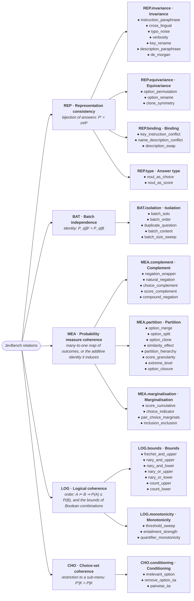

# JevBench relation taxonomy

The full list of the 50 relations, moved out of the README: the relation tree, the coverage matrix and, for each relation, what it edits, the form of its law, the quantity it checks and its variants. It is generated from `jevbench.taxonomy` with `jevbench taxonomy --write archived/taxonomy.md`, and a test fails if it drifts from the code. `jevbench relations -v` prints the same tree in the terminal.

<!-- taxonomy:start -->

50 relations in 5 dimensions and 11 groups, plus 2 unscored diagnostics. Each relation is one transformation with one law; each dimension is defined by the operation that links the two distributions its laws compare.

| Dimension | Title | Compares | Operation | Relations |
|---|---|---|---|---|
| REP | Representation consistency | two questions describe the same events | `bijection of answers: P′ = σ#P` | 15 |
| BAT | Batch independence | the question is fixed and only its companions change | `identity: P_q\|B′ = P_q\|B` | 5 |
| MEA | Probability measure coherence | the questions ask about different events of one measure | `many-to-one map of outcomes, or the additive identity it induces` | 17 |
| LOG | Logical coherence | the questions are propositions ordered by entailment | `order: A ⊨ B ⇒ P(A) ≤ P(B), and the bounds of Boolean combinations` | 10 |
| CHO | Choice-set coherence | the menu a Choice is conditioned on changes | `restriction to a sub-menu: P′\|K = P\|K` | 3 |

**Coverage by edited component.** Each mark is one relation that edits that part of the request. Empty cells (·) are combinations not yet tested. The state is not a column: no relation edits it.

| Group | key | instructions | criteria | type | batch |
|---|---|---|---|---|---|
| REP.invariance Invariance | ● | ●●●●● | ●● | · | ● |
| REP.equivariance Equivariance | · | · | ●●● | · | · |
| REP.binding Binding | ● | · | ●● | · | · |
| REP.type Answer type | · | · | ●● | ●● | · |
| BAT.isolation Isolation | · | · | · | · | ●●●●● |
| MEA.complement Complement | · | ●●●●● | · | ●● | ●●●●● |
| MEA.partition Partition | · | · | ●●●●●●●● | · | · |
| MEA.marginalisation Marginalisation | · | ●●●● | · | ●●● | ●●●● |
| LOG.bounds Bounds | · | ●●●●●●● | · | · | ●●●●●●● |
| LOG.monotonicity Monotonicity | · | ●●● | · | · | ●●● |
| CHO.conditioning Conditioning | · | · | ●●● | · | · |

**Forms of law:** `E` distributional equality; `I` identity; `L` inequality; `field` field agrees with probabilities.

#### REP · Representation consistency: `bijection of answers: P′ = σ#P`

Two questions describe the same events.

| Group | Relation | Edits | Form | Law | Check | Variants |
|---|---|---|---|---|---|---|
| REP.invariance Invariance | ● `instruction_paraphrase` | instructions | E | judged paraphrase of the instructions | `tv` | 1 rewrite (bank) |
| REP.invariance Invariance | ● `cross_lingual` | instructions, criteria | E | question translated, state untouched | `tv` | 1 rewrite (bank) |
| REP.invariance Invariance | ● `typo_noise` | instructions | E | typos, casing, punctuation | `tv` | 3 templates |
| REP.invariance Invariance | ● `verbosity` | instructions | E | redundant clarification added | `tv` | 3 templates |
| REP.invariance Invariance | ● `key_rename` | key | E | neutral question key | `tv` | random |
| REP.invariance Invariance | ● `description_paraphrase` | criteria | E | judged paraphrase of one option | `tv` | 1 rewrite (bank) |
| REP.invariance Invariance | ● `de_morgan` | instructions, batch | E | not (A and B) equals not A or not B | `nand_vs_or_not` | random |
| REP.equivariance Equivariance | ● `option_permutation` | criteria | E | options reordered, Score levels reversed | `tv` | random |
| REP.equivariance Equivariance | ● `option_rename` | criteria | E | neutral option ids, same descriptions | `tv` | fixed |
| REP.equivariance Equivariance | ● `clone_symmetry` | criteria | E | two identical options get equal probability | `clone_symmetry` | random |
| REP.binding Binding | ● `key_instruction_conflict` | key | E | negated or swapped question keys | `tv` | 2 templates |
| REP.binding Binding | ● `name_description_conflict` | criteria | E | option ids exchanged, descriptions fixed | `tv` | random |
| REP.binding Binding | ● `description_swap` | criteria | E | descriptions exchanged, ids fixed | `tv` | random |
| REP.type Answer type | ● `noul_as_choice` | type, criteria | E | Noul versus yes/no Choice | `abs_diff` | random |
| REP.type Answer type | ● `noul_as_score` | type, criteria | E | Noul versus two-level Score | `abs_diff` | 2 templates |

#### BAT · Batch independence: `identity: P_q|B′ = P_q|B`

The question is fixed and only its companions change.

| Group | Relation | Edits | Form | Law | Check | Variants |
|---|---|---|---|---|---|---|
| BAT.isolation Isolation | ● `batch_solo` | batch | E | asked alone versus in its batch | `tv` | fixed |
| BAT.isolation Isolation | ● `batch_order` | batch | E | question order reversed | `tv` | fixed |
| BAT.isolation Isolation | ● `duplicate_question` | batch | E | same question twice in one request | `within_request_tv` | fixed |
| BAT.isolation Isolation | ● `batch_content` | batch | E | other questions replaced, size fixed | `tv` | fixed |
| BAT.isolation Isolation | ● `batch_size_sweep` | batch | E | batches of 2, 5 and 10 questions | `tv` | every size |

#### MEA · Probability measure coherence: `many-to-one map of outcomes, or the additive identity it induces`

The questions ask about different events of one measure.

| Group | Relation | Edits | Form | Law | Check | Variants |
|---|---|---|---|---|---|---|
| MEA.complement Complement | ● `negation_wrapper` | instructions, batch | I | P(Q) + P(not Q) = 1, templates | `complement_gap` | 3 templates |
| MEA.complement Complement | ● `natural_negation` | instructions, batch | I | P(Q) + P(Q') = 1, natural opposite | `complement_gap` | 1 rewrite (bank) |
| MEA.complement Complement | ● `choice_complement` | type, instructions, batch | I | Noul 'not o' = 1 - P(o) | `complement_gap` | 3 templates |
| MEA.complement Complement | ● `score_complement` | type, instructions, batch | I | Noul 'not level k' = 1 - P(k) | `complement_gap` | 2 templates |
| MEA.complement Complement | ● `compound_negation` | instructions, batch | I | P(not (A and B)) + P(A and B) = 1 | `complement_gap` | random |
| MEA.partition Partition | ● `option_merge` | criteria | E | 'a or b' gets P(a) + P(b) | `tv_to_coarsened` | random |
| MEA.partition Partition | ● `option_split` | criteria | E | 'o and X' + 'o and not X' = P(o) | `tv_after_collapse` | random |
| MEA.partition Partition | ● `option_clone` | criteria | E | a clone and its original keep P(o) | `tv_after_collapse` | random |
| MEA.partition Partition | ● `similarity_effect` | criteria | E | a near-duplicate and its original keep P(b) | `tv_after_collapse` | random |
| MEA.partition Partition | ● `partition_hierarchy` | criteria | E | coarse blocks = sums of their options | `tv_to_coarsened` | random |
| MEA.partition Partition | ● `score_granularity` | criteria | E | adjacent levels merged keep their sum | `tv_to_coarsened` | fixed |
| MEA.partition Partition | ● `extreme_level` | criteria | E | a level beyond the top refines the top level | `tv_after_collapse` | fixed |
| MEA.partition Partition | ● `option_closure` | criteria | E | each option in turn replaced by a catch-all | `catch_all_tv` | every option |
| MEA.marginalisation Marginalisation | ● `score_cumulative` | type, instructions, batch | I | 'level k or higher' = upper tail, every k | `tail_gap_max`\* | 2 templates |
| MEA.marginalisation Marginalisation | ● `choice_indicator` | type, instructions, batch | I | Noul 'is it o?' = P(o), every o | `indicator_gap` | 2 templates |
| MEA.marginalisation Marginalisation | ● `pair_choice_marginals` | type, instructions, batch | I | four-way pair Choice has the Nouls as marginals | `marginal_gap` | random |
| MEA.marginalisation Marginalisation | ● `inclusion_exclusion` | instructions, batch | I | P(A and B) + P(A or B) = P(A) + P(B) | `inclusion_exclusion` | 3 templates |

#### LOG · Logical coherence: `order: A ⊨ B ⇒ P(A) ≤ P(B), and the bounds of Boolean combinations`

The questions are propositions ordered by entailment.

| Group | Relation | Edits | Form | Law | Check | Variants |
|---|---|---|---|---|---|---|
| LOG.bounds Bounds | ● `frechet_and_upper` | instructions, batch | L | P(A and B) <= min(P(A), P(B)) | `excess` | 3 templates |
| LOG.bounds Bounds | ● `nary_and_upper` | instructions, batch | L | P(all) <= min P(Ai) | `excess` | random |
| LOG.bounds Bounds | ● `nary_and_lower` | instructions, batch | L | P(all) >= sum P(Ai) - (n - 1) | `excess` | random |
| LOG.bounds Bounds | ● `nary_or_upper` | instructions, batch | L | P(any) <= min(1, sum P(Ai)) | `excess` | random |
| LOG.bounds Bounds | ● `nary_or_lower` | instructions, batch | L | P(any) >= max P(Ai) | `excess` | random |
| LOG.bounds Bounds | ● `count_upper` | instructions, batch | L | P(at least two) <= sum P(Ai) / 2 | `excess` | random |
| LOG.bounds Bounds | ● `count_lower` | instructions, batch | L | P(at least two) >= (sum P(Ai) - 1) / (n - 1) | `excess` | random |
| LOG.monotonicity Monotonicity | ● `threshold_sweep` | instructions, batch | L | 'more than k' falls with k | `monotonicity` | declared or counted |
| LOG.monotonicity Monotonicity | ● `entailment_strength` | instructions, batch | L | Q1 entails Q2 => P(Q1) <= P(Q2) | `chain` | fixed |
| LOG.monotonicity Monotonicity | ● `quantifier_monotonicity` | instructions, batch | L | all <= at least two <= at least one | `chain` | random |

#### CHO · Choice-set coherence: `restriction to a sub-menu: P′|K = P|K`

The menu a Choice is conditioned on changes.

| Group | Relation | Edits | Form | Law | Check | Variants |
|---|---|---|---|---|---|---|
| CHO.conditioning Conditioning | ● `irrelevant_option` | criteria | E | off-topic option added | `iia_tv` | random |
| CHO.conditioning Conditioning | ● `remove_option_iia` | criteria | E | each option in turn removed | `iia_tv` | every option |
| CHO.conditioning Conditioning | ● `pairwise_iia` | criteria | E | each pair of options asked alone | `iia_tv` | every pair |

#### Diagnostics (not scored)

Checks on auxiliary response fields. They test the output format, not the distribution, so they belong to no dimension, never enter a score and run only when named (`--relations diagnostics`).

| Group | Relation | Edits | Form | Law | Check | Variants |
|---|---|---|---|---|---|---|
| DIAG.fields Response fields | ● `confidence_consistency` | - | field | confidence is a function of the probabilities | `fits_definition` | fixed |
| DIAG.fields Response fields | ● `routing_stability` | - | field | 0.8 routing survives key, order, batch edits | `route_flip` | fixed |

**Form**: (E) distributional equality, (I) identity, (L) inequality. **Check**: the one quantity the relation measures. **Variants**: a law stated for every template, option, pair or size holds for a question only if it holds for every variant; its measure is the largest.

\* `score_cumulative/tail_gap_max`: largest gap over the levels k; strict, so read it with the graded score.

<!-- taxonomy:end -->
